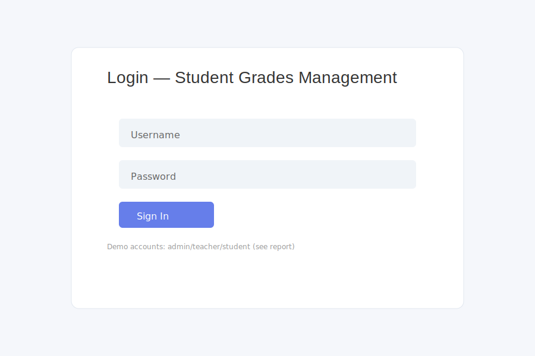
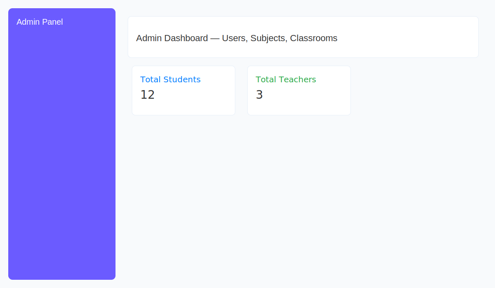
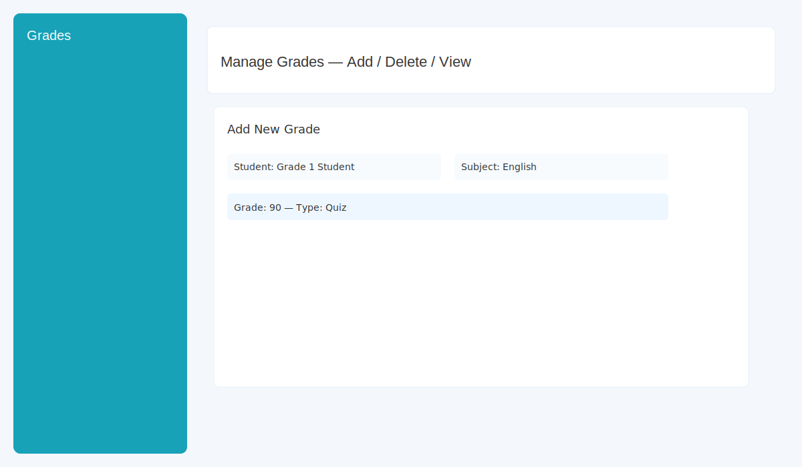
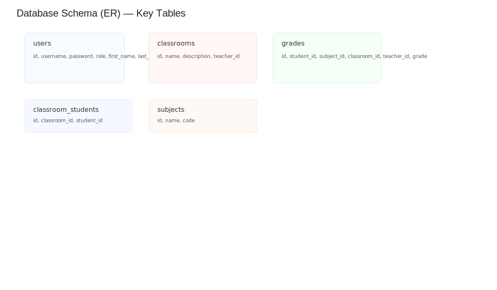

# Student Grades Management System — Project Report

**Project:** Student Grades Management System

**Location:** `c:\xampp\htdocs\student-grades-management-system`

**Date:** 2025-11-28

**Prepared by:** (auto-generated)

**Summary:**
A lightweight PHP + MySQL web application for managing users (admin/teacher/student), classrooms, subjects, and student grades. Built using plain PHP, PDO for DB access, and Bootstrap for UI.

**Contents**

- **Overview**
- **Features**
- **Architecture**
- **Database Schema (summary)**
- **Key Files / Pages**
- **Installation / Setup**
- **Usage (demo)**
- **Security & Validation**
- **Testing Checklist**
- **Future Improvements**
- **References**

**Overview**

- Web app for teachers to assign grades, students to view grades, and admins to manage users, subjects, and classrooms.
- Roles supported: `admin`, `teacher`, `student`.
- Uses PDO with prepared statements and password hashing.

**Features**

- Authentication and role-based dashboards.
- Admin: manage users, subjects, classrooms.
- Teacher: manage classrooms, students, add/edit/delete grades, grade statistics.
- Student: view grades, performance charts, grade distributions.
- CRUD operations for users, subjects, classrooms, and grades.
- Basic UI built with Bootstrap and Font Awesome.

**Architecture**

- Language: PHP (server-side), basic JS for UI interactions and Chart.js (small usage in student view).
- Database: MySQL/MariaDB (SQL dump provided: `student_grade_management.sql`).
- DB access via PDO in `includes/conn.php`.
- Shared helper functions in `includes/functions.php` (auth helpers, helpers for deleting related records, grade utilities).
- File-based MVC-ish layout: each role has its main page (`admin.php`, `teacher.php`, `students.php`) and common pages (`index.php`, `grades.php`, `classroom.php`).

**Database Schema (summary)**

- `users` (id, username, password, email, role, first_name, last_name, created_at)
- `subjects` (id, name, code, description)
- `classrooms` (id, name, description, teacher_id, created_at)
- `classroom_students` (id, classroom_id, student_id, enrolled_at)
- `grades` (id, student_id, subject_id, classroom_id, teacher_id, grade (decimal), grade_type ENUM, remarks, graded_at)

Notes:

- Foreign keys link grades -> users/subjects/classrooms and classroom_students -> users/classrooms.
- Passwords are hashed in sample SQL (bcrypt hashes present).

**Key Files / Pages**

- `index.php` — Login page and authentication handling.
- `admin.php` — Admin dashboard and management (users, subjects, classrooms).
- `teacher.php` — Teacher dashboard; lists classrooms and students.
- `grades.php` — Grade management UI (adding/deleting grades for teachers; viewing for students).
- `students.php` — Student dashboard showing grades, statistics, and charts.
- `classroom.php` — Classroom details / management (exists in repo).
- `includes/conn.php` — PDO connection and `session_start()`.
- `includes/functions.php` — Helper functions (auth checks, CRUD helpers, grading utilities).
- `student_grade_management.sql` — SQL dump with schema and example data.

**Installation / Setup**

1. Ensure XAMPP (Apache + MySQL) is installed and running.
2. Copy the project to your web root (already at `c:\xampp\htdocs\student-grades-management-system`).
3. Create the database and import the SQL dump:

   - Using phpMyAdmin or MySQL CLI, import `student_grade_management.sql`.

4. Confirm DB credentials in `includes/conn.php`:

   - Host: `localhost`
   - DB name: `student_grade_management` (as in SQL dump)
   - Username: `root` (default in the file)
   - Password: `''` (empty)

5. Start Apache and MySQL (XAMPP Control Panel). Browse to:
   - `http://localhost/student-grades-management-system/`

**Demo Accounts** (from `index.php`):

- Admin: `admin` / `admin123`
- Teacher: `teacher` / `teacher123`
- Student: `student` / `student123`

**Usage**

- Login with a demo account to see role-specific dashboard.
- Admin: add subjects/users/classrooms via forms in `admin.php`.
- Teacher: add grades in `grades.php` (must select student, subject, classroom), manage classrooms in `classroom.php`.
- Student: view grades and performance in `students.php`.

**Security & Validation**

- Passwords: stored hashed (bcrypt via `password_hash()` in code; sample SQL includes hashed passwords).
- Database access: PDO with prepared statements used across the app (protects from SQL injection where prepared statements are used).
- Session-based role checks: helper `requireRole()` and `hasRole()` in `includes/functions.php`.

Potential security notes / concerns:

- No CSRF tokens visible on forms — consider adding CSRF protection for POST forms.
- Some redirects use plain `header()` without strict validation; ensure input validation on query params (IDs) to avoid unintended actions.
- File uploads not present, so fewer attack surfaces there.
- Password rules minimal — consider enforcing stronger password policy on user creation.

**Testing Checklist (suggested manual tests)**

- Authentication: valid and invalid credentials, session behavior, redirection per role.
- Role enforcement: try teacher/student/admin pages when logged out or with wrong role.
- CRUD operations: create/update/delete users, subjects, classrooms, grades; verify related cascade operations work as expected (e.g., deleting subject deletes associated grades).
- Data validation: attempt invalid grade values (e.g., >100, negative), missing required fields.
- UI: verify tables, charts, and responsiveness (Bootstrap).
- DB integrity: ensure foreign keys enforce relationships (imported SQL sets them up).

**Future Improvements**

- Add CSRF protection and server-side input sanitization libraries.
- Add unit/integration tests (PHPUnit or simple integration scripts) for core functions in `includes/functions.php`.
- Add pagination for large tables (users/grades).
- Implement audit logs for grade changes and user management actions.
- Improve UX: AJAX for grade operations; stronger charting using real data.
- Export features: CSV/PDF export for grade reports.
- Role management UI to allow granular permissions.

**References**

- SQL dump: `student_grade_management.sql`
- Connection: `includes/conn.php`
- Helpers: `includes/functions.php`
- Pages: `index.php`, `admin.php`, `teacher.php`, `students.php`, `grades.php`, `classroom.php`

---

**Screenshots**

Below are placeholder screenshots for key pages. Real screenshots can be replaced by saving images into the `screenshots/` folder with the same filenames and they will render here.

- Login page
  

- Admin dashboard (Users / Subjects / Classrooms)
  

- Teacher dashboard (Classrooms & Students)
  

- Student dashboard (Grades & Performance)
  

- Manage Grades page (Add / Delete / View)
  

- Database schema (summary)
  

If you'd like, I can:

- Export this report to PDF,
- Add screenshots (capture pages) and embed them in the report,
- Or produce a shorter executive summary.

Which of those would you like me to do next?
